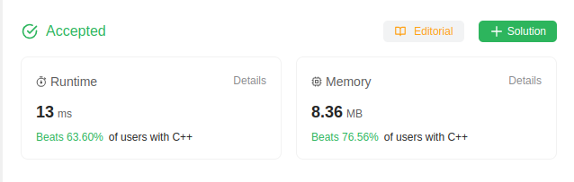
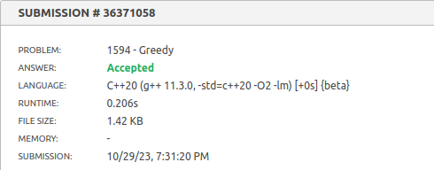
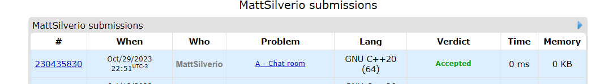
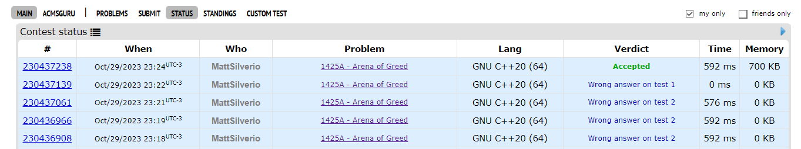

# NomedoProjeto

**Número da Lista**: 12 
**Conteúdo da Disciplina**: Algoritmos Ambiciosos

## Alunos
|Matrícula | Aluno |
| -- | -- |
| 15/0154348  | Matheus Phillipo Silverio Silva  |
| 19/0134810  | Shaíne Aparecida Cardoso de Oliveira |

## Sobre 
O repositório contém soluções para algumas questões de juíz online do LeetCode, Beecrowd...

- [Reduzindo Pratos](https://leetcode.com/problems/reducing-dishes/description/)
- [Greedy](https://www.beecrowd.com.br/judge/en/problems/view/1594)
- [Chat Room](https://codeforces.com/problemset/problem/58/A)
- [Arena Of Greed](https://codeforces.com/problemset/problem/1425/A)

## Screenshots
- Reduzindo Pratos

- Greedy

- Chat Room

- Arena of Greed

## Apresentações

**Para maior conforto, as apresentações estão no youtube. Mas caso não consiga acessa-las, os vídeos se encontram na pasta [videos](https://github.com/projeto-de-algoritmos/AlgoritmosAmbiciosos_QuestoesJuiz/tree/master/videos).**

- [Apresentação dos problemas Reduzindo Pratos e Greedy](https://youtu.be/mlSrp5uaMRQ)

## Instalação 
**Linguagem**: C++ 

## Uso 
Para rodar os algoritmos deste repositório, siga as etapas abaixo:

- Certifique-se de ter um compilador para C++ instalado em sua máquina, recomendamos o g++.
- Faça o clone do repositório Git para o seu ambiente local.
- Compile o arquivo desejado com `g++ -o <nome-do_executavel> <nome-do-arquivo.cpp>`
- Execute o arquivo com `./<nome-do-executavel>`. Certifique-se de que esteja no diretório correto em seu terminal para executar os comandos acima.
- Opcional: Deixamos os arquivos de entrada dos casos de testes de exemplo dos problemas em cada problema, afim de reduzir o tempo de digitação. Ao executar o programa, execute `./<nome-do-executavel> < <nome-do-arquivo-de-input>.txt`

